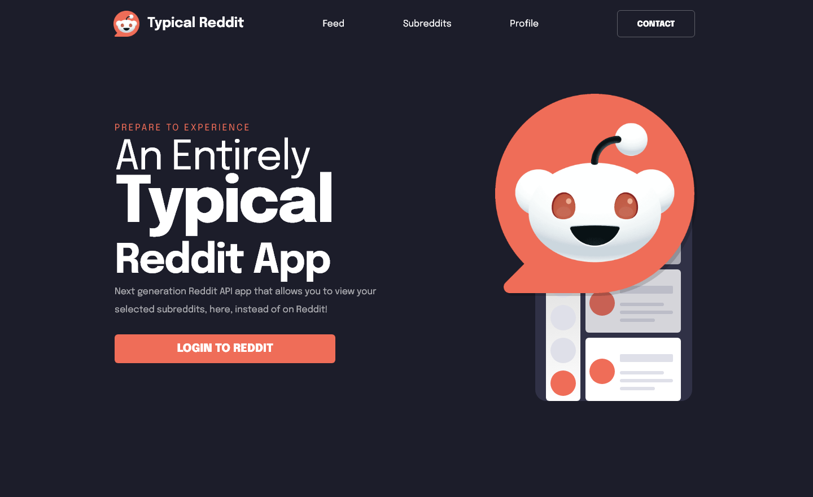
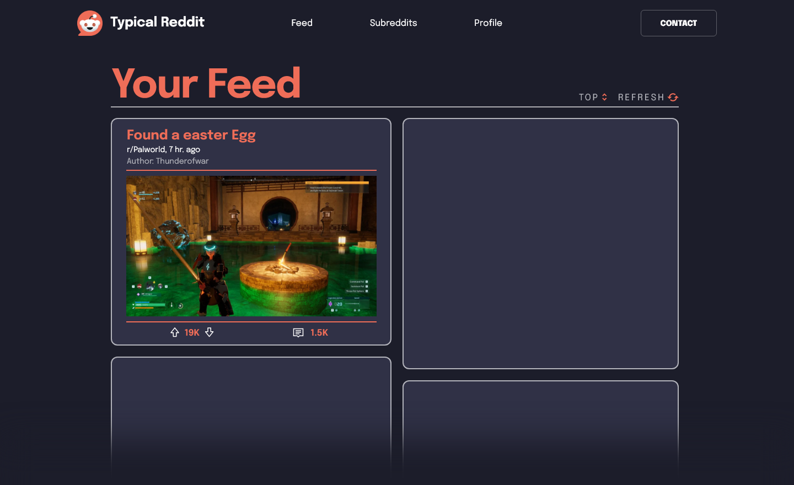
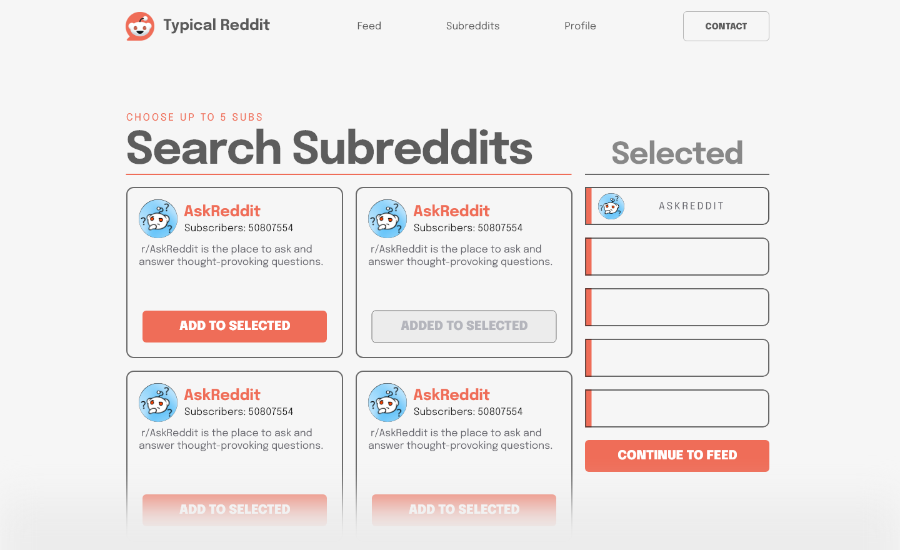
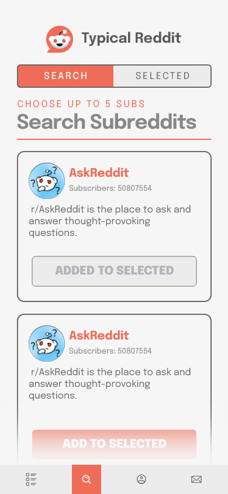
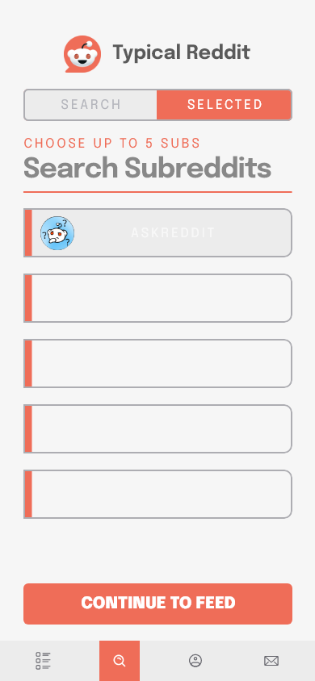

 
# Typical Reddit App

**Typical Reddit App** is a front-end application built with **React**, **Redux Toolkit**, **React Router**, **Vite**, and **TypeScript**. This app allows users to log in with their Reddit account, search for subreddits, curate a personalized feed with up to 5 subreddits, and interact with posts by upvoting, downvoting, and commenting. 

Additionally, users can toggle between light and dark modes and manage their account through a profile section. This project is designed to enhance the Reddit experience by providing a clean and customizable UI.

---

## Features

- **User Authentication**: Sign in to your Reddit account using Reddit's OAuth.
- **Search and Curate Subreddits**: Search for subreddits and select up to 5 to create a personalized feed.
- **Customized Feed**: View and interact with posts from your selected subreddits.
- **Post Interactions**: Upvote, downvote, and comment on posts in your feed.
- **Feed Customization**:
  1. Switch between a **single column** or **two-column** layout for posts.
  2. Toggle **media visibility** in posts (images/videos on or off).
- **Radix-UI Integration**: Includes a customizable and accessible **dropdown menu** for sorting and display options, as well as icons, powered by Radix-UI.
- **Profile Management**:
  - Toggle between **light** and **dark** modes.
  - Log out from your Reddit account.
- **Backend Server**:
  - **Express.js** server handles Reddit API requests locally to bypass CORS restrictions.
  - **Axios** is used for making GET requests to the Reddit API.
  - **CORS** middleware is configured for smooth communication between the server and client.
- **Routing**: Seamless navigation between pages using **React Router**.
- **Contact Developer**: A dedicated section to contact the developer, **Lev Zhitnik**.

---

## SCSS for Modularity and Scalability

The app leverages **SCSS** to maintain modularity and scalability in styling. By using features like variables, mixins, nesting, and partials, the codebase ensures:

- **Reusability**: Shared styles like button designs and typography are abstracted into mixins and variables.
- **Theme Management**: Light and dark modes are handled by modifying color variables, making it easy to scale themes in the future.
- **Readability**: Modular SCSS files separate styles by components and pages, aligning with the app's folder structure.
- **Ease of Maintenance**: Changes to global styles can be made in the `_base.scss` file, propagating throughout the app without affecting individual components.
  
To review the SCSS structure, check out the `src/styles` folder:

---

## App Architecture

### **Hierarchy**

1. **Landing Page**:
   - Log in with Reddit credentials to continue.
2. **Subreddit Selection**:
   - Search and choose up to 5 subreddits to create your feed.
3. **Feed**:
   - View and interact with posts from your selected subreddits.
4. **Subreddits Tab**:
   - Edit your subreddit selection at any time.
5. **Profile Tab**:
   - Switch between light and dark modes.
   - Log out of your account.
6. **Contact Me**:
   - Send a message to the developer.

---

## Prototype Design

Below are prototype designs used during the development process to visualize the app's layout and flow:

#### Landing Page
  
#### Select Subreddits
  
#### Feed View
  
#### Light Mode


## Tablet & Mobile
### Tablets:
#### Select Subreddits - Default
  
#### Select Subreddits - Light
  
### Mobile:
#### Subreddit Search - Default
  
#### Select Subreddits - Default
  
#### Subreddit Search - Light
  
#### Select Subreddits - Light
  


---

## Folder Structure

```plaintext
📦src
 ┣ 📂app
 ┃ ┣ 📂components
 ┃ ┃ ┣ 📂BottomGradient
 ┃ ┃ ┃ ┗ 📜BottomGradient.tsx
 ┃ ┃ ┣ 📂Button
 ┃ ┃ ┃ ┗ 📜Button.tsx
 ┃ ┃ ┣ 📂FeedUnit
 ┃ ┃ ┃ ┗ 📜FeedUnit.tsx
 ┃ ┃ ┣ 📂Header
 ┃ ┃ ┃ ┗ 📜Header.tsx
 ┃ ┃ ┣ 📂icons
 ┃ ┃ ┃ ┗ 📜RefreshIcon.tsx
 ┃ ┃ ┣ 📂Post
 ┃ ┃ ┃ ┗ 📜PostContainer.tsx
 ┃ ┃ ┣ 📂SubredditSearchUnit
 ┃ ┃ ┃ ┗ 📜SubredditSearchUnit.tsx
 ┃ ┃ ┗ 📂SubredditSelectedUnit
 ┃ ┃ ┃ ┗ 📜SubredditSelectedUnit.tsx
 ┃ ┣ 📂pages
 ┃ ┃ ┣ 📜AuthCallback.tsx
 ┃ ┃ ┣ 📜ContactPage.tsx
 ┃ ┃ ┣ 📜FeedPage.tsx
 ┃ ┃ ┣ 📜LandingPage.tsx
 ┃ ┃ ┣ 📜ProfilePage.tsx
 ┃ ┃ ┗ 📜SubredditsPage.tsx
 ┃ ┣ 📂routes
 ┃ ┃ ┣ 📜AppRoutes.tsx
 ┃ ┃ ┗ 📜ProtectedRoute.tsx
 ┃ ┣ 📂store
 ┃ ┃ ┗ 📜store.ts
 ┃ ┗ 📜App.tsx
 ┣ 📂assets
 ┃ ┗ 📜react.svg
 ┣ 📂features
 ┃ ┣ 📂auth
 ┃ ┃ ┣ 📜AuthButton.tsx
 ┃ ┃ ┗ 📜authSlice.ts
 ┃ ┣ 📂contact
 ┃ ┃ ┗ 📜ContactButton.tsx
 ┃ ┣ 📂darkLightMode
 ┃ ┃ ┗ 📜darkLightSlice.ts
 ┃ ┣ 📂feed
 ┃ ┃ ┣ 📂sort
 ┃ ┃ ┃ ┗ 📜OptionsMenu.tsx
 ┃ ┃ ┣ 📜Feed.tsx
 ┃ ┃ ┣ 📜feedSlice.ts
 ┃ ┃ ┣ 📜Refresh.tsx
 ┃ ┃ ┗ 📜TimeAgo.tsx
 ┃ ┣ 📂search
 ┃ ┃ ┣ 📜Search.tsx
 ┃ ┃ ┗ 📜searchSlice.ts
 ┃ ┗ 📂subreddits
 ┃ ┃ ┣ 📜SubredditSelectedList.tsx
 ┃ ┃ ┣ 📜SubredditSelector.tsx
 ┃ ┃ ┗ 📜subredditSlice.ts
 ┣ 📂img
 ┃ ┣ 📂logo
 ┃ ┃ ┣ 📜editedLogo.png
 ┃ ┃ ┣ 📜github-logo-typical-reddit.png
 ┃ ┃ ┗ 📜landingLogo.png
 ┃ ┗ 📂svg
 ┃ ┃ ┣ 📜comments.svg
 ┃ ┃ ┣ 📜downvote.svg
 ┃ ┃ ┣ 📜refresh.svg
 ┃ ┃ ┣ 📜sort.svg
 ┃ ┃ ┗ 📜upvote.svg
 ┣ 📂services
 ┃ ┣ 📜feedAPI.ts
 ┃ ┣ 📜server.js
 ┃ ┗ 📜subredditsAPI.ts
 ┣ 📂styles
 ┃ ┣ 📜App.scss
 ┃ ┣ 📜FeedPage.scss
 ┃ ┣ 📜Header.scss
 ┃ ┣ 📜index.scss
 ┃ ┣ 📜LandingPage.scss
 ┃ ┣ 📜OptionsMenu.scss
 ┃ ┣ 📜reset.css
 ┃ ┣ 📜Sort.module.scss
 ┃ ┣ 📜SubredditsPage.scss
 ┃ ┗ 📜_base.module.scss
 ┣ 📂types
 ┃ ┣ 📜api.ts
 ┃ ┣ 📜pages.ts
 ┃ ┣ 📜store.ts
 ┃ ┗ 📜svg.ts
 ┣ 📂utils
 ┃ ┣ 📜helpers.ts
 ┃ ┣ 📜loginURL.ts
 ┃ ┗ 📜parseResponseData.ts
 ┣ 📜main.tsx
 ┗ 📜vite-env.d.ts
```

---

## Backend Setup

This project uses a lightweight **Express.js** server to handle Reddit API requests locally, ensuring smooth communication and bypassing CORS restrictions. **Axios** is used to make GET requests to Reddit's API.

### Express Server Configuration

1. **Server Location**: The server code is located in the `src/services/server.js` file.

2. **Code Sample**:
   ```javascript
   const express = require('express');
   const axios = require('axios');
   const cors = require('cors');

   const app = express();
   const PORT = 5000;

   // Enable CORS
   app.use(cors());

   // Route to fetch subreddit data
   app.get('/api/subreddits', async (req, res) => {
       try {
           const { data } = await axios.get('https://www.reddit.com/subreddits/popular.json');
           res.json(data);
       } catch (error) {
           console.error(error);
           res.status(500).json({ error: 'Failed to fetch subreddits' });
       }
   });

   // Start the server
   app.listen(PORT, () => {
       console.log(`Server is running on http://localhost:${PORT}`);
   });
   ```

3. **Run the Server**:
   From the project root, navigate to the `src/services` folder and run:
   ```bash
   node server.js
   ```
   The server will start on `http://localhost:5000`.

---

## Installation and Usage

### Prerequisites
- Node.js (v16+)
- npm or yarn package manager

### Setup
1. Clone the repository:
   ```bash
   git clone https://github.com/levezze/reddit-app.git
   cd typical-reddit-app
   ```

2. Install dependencies:
   ```bash
   npm install
   # or
   yarn install
   ```

3. Set up environment variables:
   Create a `.env` file in the root directory and include the following:
   ```env
   VITE_REDDIT_CLIENT_ID=your-client-id
   VITE_REDDIT_REDIRECT_URI=your-redirect-uri
   VITE_REDDIT_API_URL=https://www.reddit.com/api/v1
   ```

4. Install backend dependencies:
   ```bash
   npm install express cors axios
   ```

5. Start the backend server:
   ```bash
   node src/services/server.js
   ```

6. Start the development server:
   ```bash
   npm run dev
   # or
   yarn dev
   ```

7. Open your browser and navigate to `http://localhost:5173/`.

---

## Contributing

Contributions are welcome! Feel free to submit a pull request or open an issue to report bugs or suggest features.

---

## Contact

If you have any questions, feel free to contact the developer:

**Lev Zhitnik**  
[GitHub Profile](https://github.com/Levezze)  
[Email](mailto:lev.zhi@gmail.com)

---

## Future Improvements

- **Infinite Scrolling**: Enhance feed to allow infinite scrolling.
- **Post Sorting**: Add options for sorting posts (e.g., by hot, top, new).
- **Subreddit Insights**: Display detailed insights for each subreddit (e.g., activity stats).
- **PWA**: Convert the app into a Progressive Web App for offline support.
- **Backend**: Create a user-based experience to serve as a reddit portal for regular use + notifications.
- **App**: Convert into a mobile app.

---
